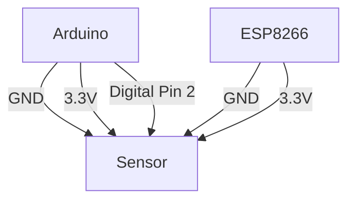

# Arduino_GlaD-OS_YouAreHere

## Description
This project implements a simple DIY alarm system using an Arduino Uno board, an ESP8266 WiFi module, and infrared (IR) sensors. 

The system can detect unauthorized intrusions and send notifications via email and WhatsApp using a Zapier webhook.

## Hardware Components
* [Arduino Uno](https://www.amazon.it/Arduino-Uno-Rev3-Scheda-microcontrollore/dp/B008GRTSV6/ref=sr_1_5?__mk_it_IT=%C3%85M%C3%85%C5%BD%C3%95%C3%91&crid=12R6G0SPAI1A9&dib=eyJ2IjoiMSJ9.kPaRFcXvbWfmHADXnkXfVmSYEFp0GeeAS7LeKrYCcUxDu2xX62AKS1RFZiNy7q-MgOUBGqG1BTIcwybX-AFj1dG-3oj2H_9nl8i3E0fKqf09-V7vuiJeLowTxynOhFmLFxSEEf2e6nLhc6LmFKqvEHJ1qcYdvUY1bdHsc6oWY5boez7wc9w4DHJHGOZr65t80o74N0v3SsKdYc4Pp1TX-EeuEyLhu0bbTsHz8Yv0cRxp-ZgNwe1_Jwf_V62SsAGTpYwuEPF5OaHwDviPXGDwYwaKouHySJB6aXrQiorev8g.o0IDcGgfl6QQ8X0L8qzP7JyQdeT27jPopVWSx5Z2sDg&dib_tag=se&keywords=Arduino+Uno&qid=1716459286&sprefix=arduino+uno%2Caps%2C118&sr=8-5)
* [ESP8266 WiFi module](https://www.amazon.it/AZDelivery-ESP8266-adattatore-Breadboard-gratuito/dp/B072R6DPK7/ref=sr_1_5?__mk_it_IT=%C3%85M%C3%85%C5%BD%C3%95%C3%91&crid=3JA97EWGI7VSV&dib=eyJ2IjoiMSJ9.35oAY0VGEmhr2JYoJARmzwATfPeJWZyPc-r2j8K6TgqNxZkt8HjrjOBpbP5RMrNQTUUhV4e7A_XM3ic-vQHiW3WQT3bO11Y-ToeldHliBFLgKCOaF2kGkMs_xJUIBm1Xq34tmJA3dqn0SSVj8xRS03KR08O2K3S7ces6GBIQ-g2fnbGfeEQrFqksmmGwPujBFPq2ueAmdb11XYLfBTE6rhNwHNA0quu_4tG6rnN1Qzrh8WzGTgnfoqm8-DVUhDGHQlIM6JEFxz2WRYgnxm0mwIxOy7uZIWG3-sLFddpAB28.F1iJ-d5Go62DFueRVJ3R5CPOgTGYHuFwP0LDAgyroVc&dib_tag=se&keywords=ESP8266+WiFi+module&qid=1716459249&sprefix=esp8266+wifi+module%2Caps%2C181&sr=8-5)
* [Infrared (IR) sensors AZDelivery 3](https://www.amazon.it/AZDelivery-ultrasuoni-distanza-Raspberry-Abstandsensor/dp/B07D924JHT/ref=sr_1_5?crid=1GVJ3E7OTDHJQ&dib=eyJ2IjoiMSJ9.lQuxplvoPEFyttVUzGFcuGy1_e8DNZvPvLdHZ5f7izeQn4mO4qFq5Oyzfp8sPktd37W-IjXdXxHFMgjeMeN2DsAhM9WYUCF658ORuZoTq3J1qYq4gRe6KyOusM_AABJk2ZsxHoFkmEa09jeDsvc0D9vOwNbxGpvle63eHBAXUBegNvB0gnOE7OnzrDU_zDu71jjIlkO82K4OD6U2QamdHvbirRSIwVdu64sXm_FUyKvXLFy7HZezFXf4SP13pQgERAmk7Y66cTJlteLt5V3N3UISNydJE9dF4zdVtodbwTA.ln06M0V_fbHWGbMdJcv2dw_kRzZUAili90N8Nu04cb8&dib_tag=se&keywords=arduino%2Binfrared%2Bsensor&qid=1716458294&sprefix=arduino%2Binfr%2Caps%2C144&sr=8-5&th=1)
* Breadboard
* Jumper wires
* Resistors
### Electrical Schematic


**Note**: Connect the GND and VCC pins of the sensor module to the corresponding GND and 3.3V pins on the ESP8266 module. Connect the OUT pin of the sensor module to a digital pin on the Arduino (e.g., pin 2).

## Operations
0. **Installment**: Install at home the hardware connected to stable power and wifi supplies
1. **Activation**: The IR Sensor is activated manually through a GitHub workflow
2. **Detection**: If the IR sensor detect motion, it sends an HTTP request with a JSON body to a Zapier webhook.
3. **Notification**: The Zapier webhook I configured processes the request and sends notifications via email and WhatsApp to predefined contacts.

### Request
The request cabled to be sent to Zapier is defined here:
| Key | Description | Type |
| -- | -- | -- |
| value1 | Static message to be recognized by the Webhook | string |
| timestamp | Dynamic timestamp formatted as: "**YYYY-mm-DD HH:MM:ss**" | dateTime |

```json
{
  "value1": "Alert! Motion detected",
  "timestamp": "2024-05-23 10:20:00"
}
```
   
## Customization
This system is flexible and can be customized according to individual needs by configuring custom Webhooks on [Zapier](https://zapier.com/), or you can also use other providers like [IFTTT](https://ifttt.com/).

### Environment Variables and Secrets
To succesfully make the `.ino` code works you might need to change the Repository Variables and create some Codespaces secrets.
#### Repository Variables
| Key | Value | Description |
| -- | -- | -- |
| SENSOR_PIN | 2 | The pin where the IR sensor is cabled to |
| TIMEZONE_STRING | Europe/Rome | The timezone where to get systime |
#### Codespaces Secrets
You need to create those since are secrets and not passed through forks. Keys are the AS-IS hardcoded in `.ino` file, if you'll change them you need to modify the code.
| Key | Value | Description |
| -- | -- | -- |
| WIFI_IP | YourCustomValue | The IP of your ESP8266 module |
| WIFI_PASSWORD | YourCustomValue | Your WiFi password |
| WIFI_SSID | YourCustomValue | Your WiFi net name |
| ZAPIER_WEBHOOK_URL | YourCustomValue | When creating a webhook trigger on Zapier they give you a custom url to trigger the automation via HTTP request |

